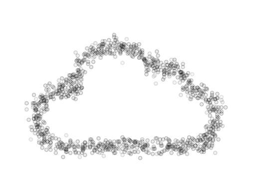
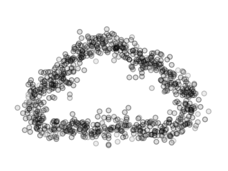
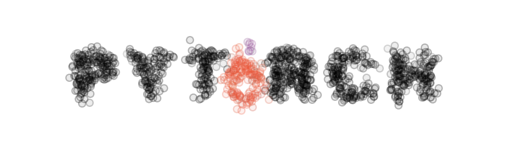

logo-dataizer
================

<!-- WARNING: THIS FILE WAS AUTOGENERATED! DO NOT EDIT! -->

Convert logos or icons into scatterplots of “datapoints”

## Install

``` sh
pip install logo_dataizer
```

## How to use

https://davegrays.github.io/logo-dataizer/

initialize

``` python
from logo_dataizer.scatterizer import Scatterizer
scatterizer = Scatterizer()
```

run scatter() on any image type, just giving the filepath

``` python
scatterizer.scatter("../data/cloud.png")
```




By default, the output will be saved in the same location with
“\_scatterized” appended to the filename

The following settings can be modified (defaults are in the docstring)

- number of points to generate
- amount of scatter
- opacity
- point size
- size of the output image

e.g.

``` python
scatterizer.scatter(
    "../data/cloud.png",
    n_samples=800,
    var=0.3,
    alpha=0.4,
    width=4,
)
```




``` python
colors = scatterizer.scatter(
    "../data/pytorch_logo.png",
    n_samples=1200,
    var=0.3,
    alpha=0.25
)
```



